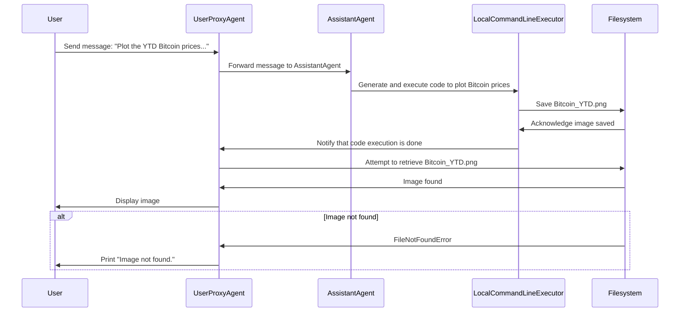
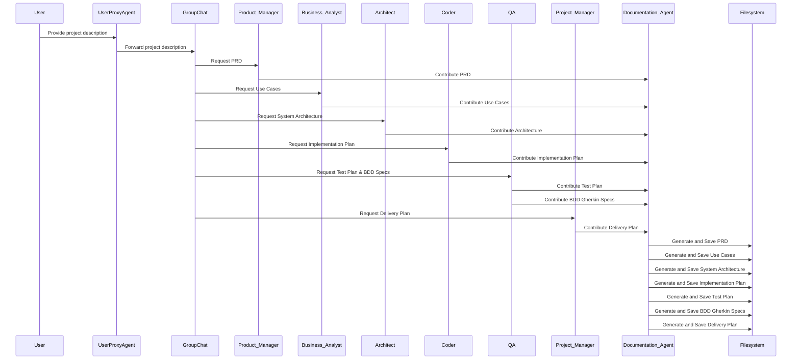

# Demos4Course: AI-Agent and Multi-Agent Systems Demos
This repository contains demos created to illustrate the concepts of AI-Agents and Multi-Agent Systems. This project was created as part of the [AI4Devs](https://www.lidr.co/ia-devs) for [LIDR](https://www.lidr.co/) course, to understand the orchestration and collaboration of multiple intelligent agents working together to solve tasks.

---

## Demo1
### Participants:
- **User:** Initiates the process by sending a request through a proxy agent.
- **UserProxyAgent** (proxy_usuario): Acts as an intermediary for user commands, passing them to the **Assistant Agent** and handling code execution.
- **AssistantAgent** (asistente): Responsible for responding to the user's commands. It uses the Mistral API for its configuration.

### Sequence Flow:
1. **UserProxyAgent** receives a message from the user: *"Plot the YTD Bitcoin prices in Euros and volume of transactions Bitcoin_YTD.png.*"
2. **UserProxyAgent** forwards the message to **AssistantAgent** (asistente).
3. **AssistantAgent** processes the request, generates a code to plot the Bitcoin YTD prices, and passes it to the LocalCommandLineCodeExecutor for execution.
	- The LocalCommandLineCodeExecutor executes the code in the specified directory (contenido).
After execution, the code saves the generated image (Bitcoin_YTD.png) in the filesystem.

	The script tries to display the image from the Filesystem using the IPython.display.Image class. If the image is found, it is displayed, otherwise, an error message is printed.




### Explanation:
1. UserProxyAgent forwards the user’s request to AssistantAgent.
2. AssistantAgent generates a code based on the user's request and passes it to the
3. LocalCommandLineExecutor to execute it.
	- The LocalCommandLineExecutor saves the generated image in the Filesystem.

- User then retrieves the image from the Filesystem and either displays it or prints an error message if the file is not found.


## Demo2
### Key Components:

1. **User**: Initiates the project request by providing a description.
2. **UserProxyAgent**: Represents the user and forwards the project description and requests to other agents.
3. **Project Manager (PM)**: Responsible for creating a detailed delivery plan with milestones, timelines, and resource allocation.
4. **Product Manager (Product_Manager)**: Creates the Product Requirements Document (PRD) detailing the project's features and objectives.
5. **Business Analyst (BA)**: Document use cases and create a diagram of them.
6. **Architect**: Designs the system architecture using C4 and Mermaid diagrams.
7. **Coder**: Prepares a detailed implementation plan focusing on best coding practices and efficient algorithms.
8. **QA**: Creates a testing plan, including functional, integration, and regression testing, and provides BDD specifications in Gherkin.
9. **Documentation Agent**: This person is responsible for compiling contributions from other agents and generating the final project documentation.
10. **GroupChat**: Coordinates and manages communication among agents during the project.
11. **GroupChatManager**: Orchestrates the workflow of the group chat, ensuring smooth communication and task execution.

### Sequence Flow:

1. **User provides a project description**: The user is asked to describe the project.
2. **UserProxyAgent forwards the project description**: The description is passed to the group chat, where different agents contribute based on their roles.
3. **Phase 1: Contributions from various agents**:
    - **Product Manager** contributes the PRD.
    - **Business Analyst** contributes use cases and a use case diagram.
    - **Architect** contributes to the system architecture.
    - **Coder** contributes an implementation plan.
    - **QA** contributes to the testing plan and BDD specifications.
    - **Project Manager** contributes to the delivery plan.
4. **Documentation Agent compiles the contributions**: The documentation agent collects all contributions from the agents.
5. **Asynchronous document generation**: The documents are generated asynchronously for each section (PRD, use cases, architecture, implementation plan, etc.).


### Explanation of the Code Flow:

1. **Loading environment variables**: The code first loads environment variables from a `.env` file using `load_dotenv()`. These variables are used to configure the API keys for the Mistral and OpenAI APIs.
2. **LLM Configuration**: Three configurations for the language model (LLM) are created with different temperature settings (`high`, `normal`, and `low`), each representing different creativity levels (e.g., higher temperature for creative tasks, lower temperature for structured tasks).
3. **Agent Initialization**: Various agents are initialized, each responsible for a specific aspect of the project. The agents are configured using the Mistral API and their respective system messages, which define their responsibilities.
    - **UserProxyAgent**: Handles user requests and code execution.
    - **Product Manager, Business Analyst, Architect, Coder, QA, Project Manager**: Specialized agents contribute to different project documents.
    - **Documentation Agent**: Collects contributions and generates the final project documents.
4. **Group Chat and Manager Setup**: The group chat and manager (`GroupChatManager`) are initialized, managing the agents' interactions and communications.
5. **Project Workflow**:
    - The project workflow starts when the user provides a description of the project.
    - The `UserProxyAgent` sends this description to the group chat, prompting contributions from various agents.
    - Each agent contributes content (e.g., PRD, use cases, architecture) to the **Documentation Agent**, which compiles everything.
    - The contributions are generated asynchronously and saved to the filesystem as markdown files.
6. **Asynchronous Document Generation**: The final project documents are generated asynchronously, ensuring non-blocking execution and allowing agents to work simultaneously.

### Summary:

This code sets up a collaborative environment where multiple AI agents contribute to different aspects of a project (e.g., planning, documentation, testing). The agents operate in phases, and their outputs are compiled into a final set of project documents. The asynchronous execution ensures efficient handling of multiple tasks, while retries and error handling provide resilience in the process.

## How to Get Started
To clone the repository and set up your local environment, follow these steps:

1. Clone the repository:

```bash
git clone https://github.com/your-repo/Demos4Course.git
cd Demos4Course
```

2. Set up environment variables by creating a .env file with your API keys:

```makefile
MISTRAL_API_KEY=<your-mistral-api-key>
```

You can obtain the API key for Mistral at <https://console.mistral.ai/api-keys/>. So, as you know, you will need a Mistral.ai account.


## Contributing
This project is open for contributions! Please submit pull requests, raise issues, or suggest any features. Your feedback is invaluable.
