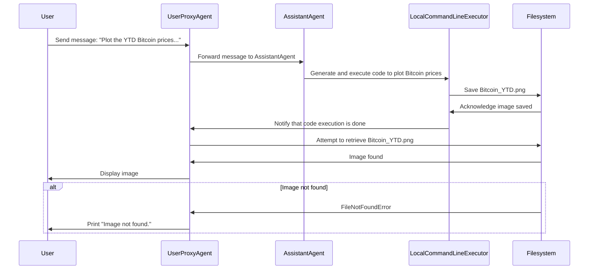
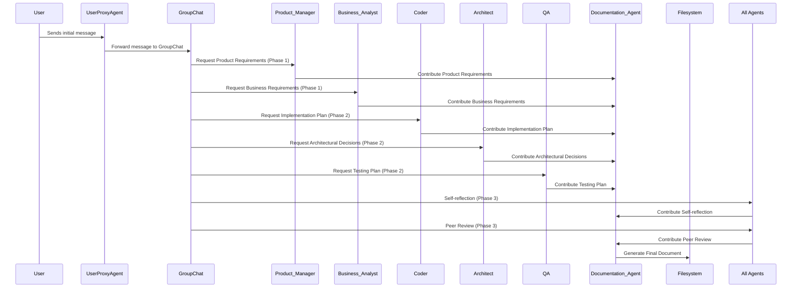

# Demos4Course: AI-Agent and Multi-Agent Systems Demos
This repository contains demos created to illustrate the concepts of AI-Agents and Multi-Agent Systems. This project was created as part of the [AI4Devs](https://www.lidr.co/ia-devs) for [LIDR](https://www.lidr.co/) course, to understand the orchestration and collaboration of multiple intelligent agents working together to solve tasks.

---

## Demo1
### Participants:
- **User:** Initiates the process by sending a request through a proxy agent.
- **UserProxyAgent** (proxy_usuario): Acts as an intermediary for user commands, passing them to the **Assistant Agent** and handling code execution.
- **AssistantAgent** (asistente): Responsible for responding to the user's commands. It uses the Mistral API for its configuration.

### Sequence Flow:
1. **UserProxyAgent** receives a message from the user: *"Plot the YTD Bitcoin prices in Euros and volume of transactions Bitcoin_YTD.png.*"
2. **UserProxyAgent** forwards the message to **AssistantAgent** (asistente).
3. **AssistantAgent** processes the request, generates a code to plot the Bitcoin YTD prices, and passes it to the LocalCommandLineCodeExecutor for execution.
	- The LocalCommandLineCodeExecutor executes the code in the specified directory (contenido).
After execution, the code saves the generated image (Bitcoin_YTD.png) in the filesystem.

	The script tries to display the image from the Filesystem using the IPython.display.Image class. If the image is found, it is displayed, otherwise, an error message is printed.




### Explanation:
1. UserProxyAgent forwards the user’s request to AssistantAgent.
2. AssistantAgent generates a code based on the user's request and passes it to the
3. LocalCommandLineExecutor to execute it.
	- The LocalCommandLineExecutor saves the generated image in the Filesystem.

- User then retrieves the image from the Filesystem and either displays it or prints an error message if the file is not found.


## Demo2
### Participants:
- **User** (External actor interacting with the system)
- **UserProxyAgent** (Proxy for the human input)
- **Product Manager** (PM) (Collaborates in Phase 1)
- **Business Analyst** (BA) (Collaborates in Phase 1)
- **Architect** (Collaborates in Phase 2)
- **Coder** (Collaborates in Phase 2)
- **QA** (Collaborates in Phase 2)
- **Documentation Agent** (Responsible for collecting and finalizing the documentation)

### Sequence Flow:
1. **User** sends an initial message via **UserProxyAgent**: The user initializes the conversation with the group chat by providing the message: *"We are designing a new clone of Jira, we want to include AI in order to help with the creation of Tickets and assigning to the right person."*.
3. **Phase 1:** **Product Manager** and **Business Analyst** collaboration:
- **Product Manager** responds with product requirements and contributes to the documentation through the Documentation Agent.
- **Business Analyst** responds with business requirements and use cases, also contributing to the Documentation Agent.
3. **Phase 2:** **Coder**, **Architect**, and **QA** collaboration:
- **Coder** responds with the implementation plan and contributes it to the Documentation Agent.
- **Architect** responds with architectural decisions and contributes it to the Documentation Agent.
- **QA** responds with the testing plan and contributes to the Documentation Agent.
4. **Phase 3:** Self-reflection and Peer Review:
Each agent (except **UserProxyAgent** and **Documentation_Agent**) reflects on their contribution and suggests improvements.
Each agent also peer-reviewed other agents' contributions; their feedback was stored in the documentation.
5. **Final Documentation Generation:** After the collaboration phases, the **Documentation Agent** generates the final document by compiling all contributions, self-reflections, and peer reviews.

### Key Interactions:
1. **UserProxyAgent** sends an initial message to the **GroupChat**.
2. **GroupChat** coordinates the collaboration phases, requesting contributions from different agents (**PM**, **BA**, **Architect**, **Coder**, **QA**).
3. Each agent sends its contribution to the **Documentation Agent**.
4. In **Phase 3**, agents contribute self-reflections and peer reviews, which are also stored in the final document by the **Documentation Agent**.



## How to Get Started
To clone the repository and set up your local environment, follow these steps:

1. Clone the repository:

```bash
git clone https://github.com/your-repo/Demos4Course.git
cd Demos4Course
```

2. Set up environment variables by creating a .env file with your API keys:

```makefile
MISTRAL_API_KEY=<your-mistral-api-key>
```

You can obtain the API key for Mistral at <https://console.mistral.ai/api-keys/>. So, as you know, you will need a Mistral.ai account.


## Contributing
This project is open for contributions! Please submit pull requests, raise issues, or suggest any features. Your feedback is invaluable.
